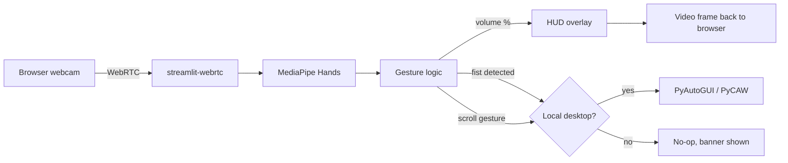

# 🎮 Real-Time Gesture Controller

A hand-gesture control surface built with **Streamlit**, **streamlit-webrtc**,
**MediaPipe Hands**, and **OpenCV**. Point a webcam at your hand and control
system volume, media playback, and page scrolling in real time.

**Live demo:** https://gesture-controller.streamlit.app

---

## ⚠️ Cloud demo vs. local full control

This app runs in two capability tiers depending on where it's hosted, and it
detects which one it's in automatically — no configuration needed.

| Feature | Streamlit Cloud (this demo) | Running locally |
|---|---|---|
| Webcam capture + hand tracking | ✅ | ✅ |
| Live skeleton overlay + volume HUD | ✅ | ✅ |
| **System volume control** | 🚫 (needs Windows) | ✅ on Windows |
| **Play/pause & scroll (keyboard/mouse sim)** | 🚫 (needs a desktop session) | ✅ |

Cloud containers have no audio device and no display server, so PyCAW
(Windows Core Audio) and PyAutoGUI (keyboard/mouse simulation) can't act on
anything there — the app detects this at startup and shows a banner instead
of crashing. Clone the repo and run it on your own machine to get full
control.

---

## 🖐️ Gestures

| Gesture | Action |
|---|---|
| Pinch (thumb + index finger) | Volume, scaled to finger separation |
| Closed fist | Play / pause (spacebar) |
| Middle finger raised, move up/down | Scroll |

---

## 🏗️ Architecture



---

## ⚙️ Setup

### Prerequisites
- Python 3.11 (see `.python-version`)
- A webcam
- For full OS control: Windows (audio) and any desktop OS with a display
  session (keyboard/mouse simulation)

### Install & run

```bash
git clone https://github.com/<your-username>/gesture-controller.git
cd gesture-controller

python -m venv venv
source venv/bin/activate   # venv\Scripts\activate on Windows

pip install -r requirements.txt
streamlit run app.py
```

### Deploying to Streamlit Community Cloud

`packages.txt` lists the system libraries OpenCV's non-headless
transitive dependency (`opencv-contrib-python`, pulled in by `mediapipe`)
needs on a minimal Debian container:

```
libgl1
libglib2.0-0t64   # Debian trixie renamed this package; see note below
libsm6
libxext6
libxrender1
```

> **Note:** if your base image isn't Debian trixie, `libglib2.0-0t64` may
> not exist — use `libglib2.0-0` instead (or drop the line; `libsm6`/
> `libxrender1` usually pull in a compatible glib transitively).

---

## 🧰 Repo utilities

`setup_and_push.py` creates a GitHub repo (if it doesn't already exist)
and pushes the current directory to it. Requires a `GITHUB_TOKEN`
environment variable with `repo` scope:

```bash
export GITHUB_TOKEN=ghp_xxx        # Windows: $env:GITHUB_TOKEN='ghp_xxx'
python setup_and_push.py
```

---

## 📄 License

MIT — do whatever you like with it.